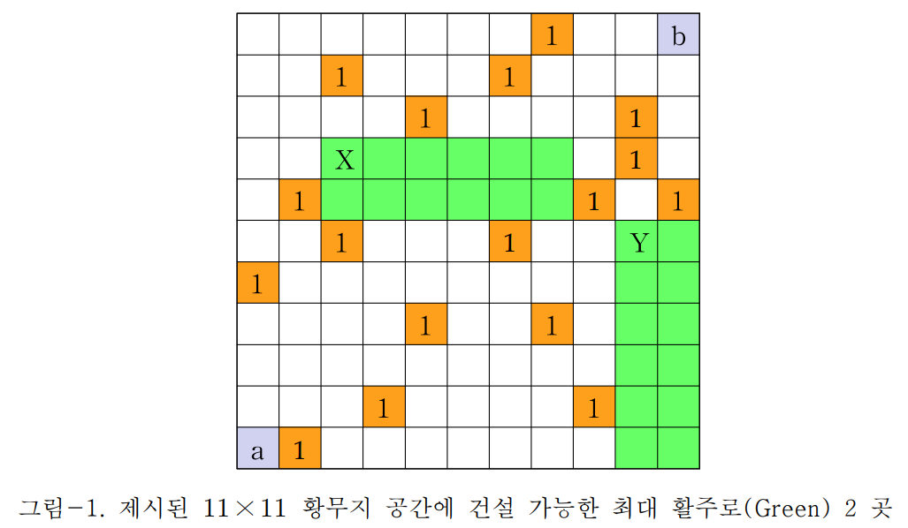

# Runway

---

**[문제]**

아주 넓은 황무지에 직선의 비행기 활주로를 건설하려고 한다. 이 황무지에는 군데군데 처리하기 어려운 대형 암석이나 웅덩이가 있다. 여러분은 이러한 장애물을 피해서 가장 긴 길이의 활주로가 가능한 부지를 찾아야 한다.

황무지는 아래 그림과 같이 N × M 그리드(grid) 공간으로 표시되며 장애물은 gray cell로 표시된다. N은 행의 길이, M은 열의 길이이다. 우리가 찾아야 하는 활주로는 어떤 장애물도 포함하지 않는 2 × W 또는 W × 2 크기의 띠(strip) 형태의 공간이다.

여러분은 이 2 × W 또는 W × 2 형태의 공간 중에서 최대 W의 공간을 찾아야 한다. 아래 그림-1에는 11 × 11인 황무지와 그곳에서 건설 가능한 최대 활주로 후보지 2개가 초록색으로 표시되어 있다. 그 최적 활주로의 길이는 W=6이며, 이보다 더 긴 활주로는 불가능하다.

그림-1. 제시된 11 × 11 황무지 공간에 건설 가능한 최대 활주로(Green) 2곳

[입출력] 입력과 출력은 모두 표준 입출력을 사용한다. 입력 파일 stdin의 첫 줄에는 황무지 그리드 N × M의 크기를 나타내는 정수 N, M이 주어진다. N은 행의 길이, M은 열의 길이를 의미한다. 단 최대 크기는 1 ≤ N,M ≤ 2000으로 제한된다.

그 다음 2번째 줄부터 이어지는 N개의 줄에는 길이 M인 이진 문자열(binary string)이 각각 주어진다. 0은 빈 공간, 1은 장애물을 의미한다. 황무지 cell의 좌표는 다음과 같이 정의된다. 제일 왼쪽 아래 cell (left lower)의 좌표는 (1,1)이고 오른쪽 위의 좌표는 (N,M)이다.

여러분은 이 황무지 공간을 표시한 입력 파일을 그 안에서 건설 가능한 가장 긴 활주로를 찾아서 그 왼쪽

1. 그림에서 a=(1,1), b=(11,11)
2025 Algorithms < No.2 Runway> Prof. Zoh Q.위(left upper) 코너의 좌표 (x,y)와 그 길이 W, 이 3개의 정수를 출력 파일 stdout의 첫 줄에 'x y W'로 출력해야 한다.만일 위 그림-1과 같이 같은 길이의 최장 활주로가 하나 이상 존재할 경우에는, 지정 위치 좌표의 사전식 순서로 볼 때, 가장 빠른 좌표를 출력해야 한다. 즉 위 그림의 경우 W=6인 활주로의 코너 좌표가 (3,8), (10,6)이므로 이 중에서 사전식으로 가장 빠른 (3,8)을 정답으로 선택해야 한다.다른 예로 최대 활주로의 코너 좌표가 4개이며 그것이 {(10,3), (7,4), (5,2), (5,11)}와 같다면 이 중에서 사전식 순서로 볼 때 가장 "빠른" (5,2)를 선택해야 한다. 그리고 만일 길이 1 이상인 활주로가 존재하지 않는 특별한 경우라면 이를 표시하기 위해 3개의 zero를 '0 0 0'으로 출력해야 한다.

**[예제]**

<table>
    <thead>
    <tr>
        <th>stdin</th>
        <th>stdout</th>
    </tr>
    </thead>
    <tbody>
        <tr>
            <td style="text-align: left; vertical-align: top;">
                11 11 
                00000001000 
                00100010000 
                00001000010 
                00000000010 
                01000000101 
                00100010000 
                10000000000 
                00001001000 
                00000000000 
                00010000100 
                01000000000
        </td>
            <td style="text-align: left; vertical-align: top;">
                3 8 6
            </td>
        </tr>
    </tbody>
</table>

  

<table>
  <thead>
    <tr>
      <th>stdin</th>
      <th>stdout</th>
    </tr>
  </thead>
  <tbody>
    <tr>
      <td style="text-align: left; vertical-align: top;">
        12 6 
        010101 
        101010 
        010101 
        101010 
        010101 
        101010 
        ...
        </td>
        <td style="text-align: left; vertical-align: top;">
            0 0
        </td>
    </tr>
  </tbody>
</table>

  

**[제한조건]**

제출 프로그램은 runway.{c, cpp, py}이다. 제출횟수는 최대 15회, 각 데이터 당 수행 제한 시간은 1초이다. 과제 마감시간은 3월 14일(금) 저녁 10시이며, 제출은 3월 10일 월요일부터 가능하다. 단 여러분의 코드에서 사용할 수 있는 token의 최대 개수는 700이다. 이번 과제를 Python으로 구현하면 쉽지만, N,M이 큰 경우에는 제한 시간 1초를 넘을 수도 있으므로 이를 피할 수 있도록 각별히 신경을 써야 한다.

**[추가사항]**

만점 코드 중에서 가장 속도가 빠른 상위 3개 코드의 제출자에게는 +5% 가점이 주어진다. 속도는 15개 데이터를 수행한 시간의 합으로 계산된다. Python의 경우에는 외부 모듈은 numpy까지만 허용된다. 따라서 다른 추가의 보조 모듈을 사용할 수 없다. NESPA에 주어진 5개의 데이터로 시간을 측정할 수 있을 것이다. 시간은 CPU time으로 측정한다. 간혹 너무 빠른 PC를 사용해서 개인 PC에서 1초 아래이지만 NESPA 서버에서는 1초를 초과할 수 있으므로 최대한 빠르게 수행될 수 있도록 코드에 최선을 다해야 한다.
