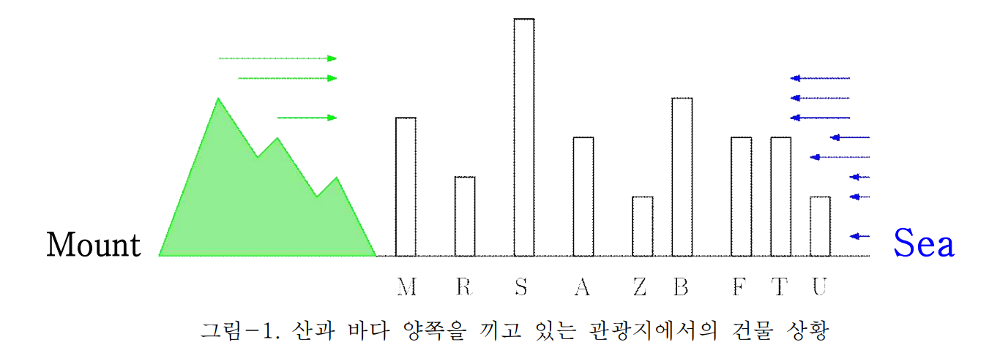

**[문제]**

해변과 산을 끼고 있는 관광지에 여러 호텔과 기관 건물이 서 있다. 상업지구로 지정된 곳에서는 건물 사이의 최소거리 등의 조건이 느슨하여 많은 건물이 더 좋은 뷰를 위해 무분별하게 세워지고 있다. 이런 문제로 이전까지 바다 풍경(sea view)이나 산 풍경(mountain view)이 잘 보이던 건물들이 앞뒤 건물에 가려 볼 수 없게 되었다.

아래 그림-1에는 9개의 건물이 표시되어 있다. 왼쪽은 산이고 오른쪽은 바다이다. 이 상황에서 바다를 볼 수 있는 건물은 {S, B, T, U}이며, 산을 볼 수 있는 건물은 {M, S} 2개뿐이다. {A, Z, F, R}은 앞뒤 건물에 가려 산도 바다도 볼 수 없다. M은 산만 볼 수 있다.

*그림-1. 산과 바다 양쪽을 끼고 있는 관광지에서의 건물 상황*

**[입출력]**

입력과 출력은 모두 표준 입출력을 사용한다. 입력 파일 stdin의 첫 줄에는 건물의 개수 N이 주어진다(단, N ≤ 100). 이어지는 N개의 각 줄에는 건물 이름을 나타내는 영문 대문자 1자와 그 건물의 높이를 나타내는 정수 H가 주어진다(단, H ≤ 1000). stdout 출력은 2줄로 구성된다. 첫 줄에는 산 전망이 보이는 건물의 이름을 왼쪽부터 차례대로 공백을 두고 출력하고, 다음 줄에는 바다 전망이 가능한 건물을 같은 방식으로 출력한다. 

**[예제]**

<table>
  <thead>
    <tr>
      <th>stdin</th>
      <th>stdout</th>
      <th>stdin</th>
      <th>stdout</th>
    </tr>
  </thead>
  <tbody>
    <tr>
      <td style="text-align: left; vertical-align: top;">
        9 
        M 51 
        R 34 
        S 82 
        A 40 
        Z 21 
        B 65 
        F 40 
        T 40 
        U 13
      </td>
      <td style="text-align: left; vertical-align: top;">
        M S 
        S B T U
      </td>
      <td style="text-align: left; vertical-align: top;">
        8 
        A 50 
        B 50 
        C 50 
        R 100 
        G 50 
        H 50 
        J 50 
        K 50
      </td>
      <td style="text-align: left; vertical-align: top;">
        A R 
        R K
      </td>
    </tr>
  </tbody>
</table>

**[제한조건]**

제출 프로그램은 view.{c, cpp, py}이다. 제출횟수는 최대 15회, 각 데이터당 수행 제한시간은 1초이다. 제출시간은 저녁 10시부터 12시까지이다. 코드의 token은 최대 350개이다.